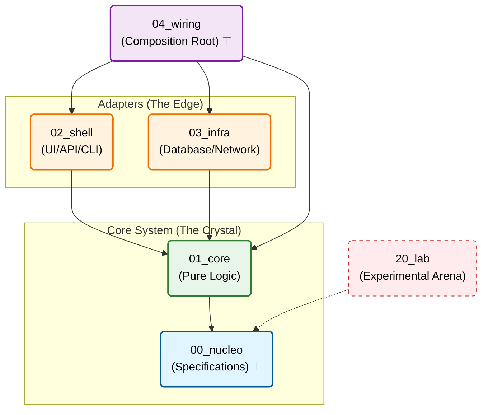

# Tekt 
## Crystalline Architecture Standard

<div align="center">

**A topology-enforced framework for AI-resistant software development**

[](./MANIFESTO.md)
[](./LICENSE)

[**Manifesto**](./MANIFESTO.md) • [**Quick Start**](#quick-start) • [**Documentation**](#documentation) • [**Examples**](#examples)

</div>

---

## 💎 Mathematical Foundation

The Crystalline Standard treats software architecture as a **Topological Space** governed by strict mathematical laws to minimize structural entropy $H$.

### Core Structure

* **System Topology** ($\mathcal{T}$): A Directed Acyclic Graph (DAG) where nodes are layers $L_n$ and edges are dependency morphisms
* **Dependency Poset**: Partially ordered set $(L, \preceq)$ following: 
  $$L_0 \preceq L_1 \preceq \{L_2, L_3\} \preceq L_4$$
  where $L_0$ (Nucleus) is the **bottom element** ($\bot$)
* **Entropy Control**: The **Nucleation Invariant** enforces:
  $$\text{Code} \neq \emptyset \iff \text{Spec} \neq \emptyset$$

---

## Quick Start

### 1. Create Project from Template

```bash
git clone https://github.com/your-org/crystalline-architecture-standard.git my-project
cd my-project
```

### 2. Initialize Structure

*(Step removed: Structure is now verified dynamically, without static maps)*


### 3. Create Your First Feature

#### Step A: Write Specification (Nucleation)

```bash
cat > 00_nucleo/specs/user-login.md <<'EOF'
# Feature: User Login

## Requirements
1. Accept email + password
2. Return JWT token (expires 24h)
3. Rate limit: 5 attempts per minute

## Business Rules
- Passwords must be hashed with bcrypt (cost=12)
- Failed attempts trigger exponential backoff
EOF
```

#### Step B: Implement Core Logic (Pure)

```typescript
// 01_core/domain/auth.ts
/**
 * Crystalline Lineage
 * @spec 00_nucleo/specs/user-login.md
 * @topology L1
 */
export function validateCredentials(
  email: string,
  password: string,
  hashedPassword: string
): boolean {
  // Pure validation (no I/O)
  const emailRegex = /^[^\s@]+@[^\s@]+\.[^\s@]+$/;
  if (!emailRegex.test(email)) return false;
  
  return bcrypt.compareSync(password, hashedPassword);
}
```

#### Step C: Add Persistence (Infrastructure)

```typescript
// 03_infra/database/user-repository.ts
/**
 * Crystalline Lineage
 * @spec 00_nucleo/specs/user-login.md
 * @topology L3
 */
import { IUserRepository } from '../../01_core/contracts/user-repository';

export class UserRepository implements IUserRepository {
  async findByEmail(email: string): Promise<User | null> {
    return await db.users.findUnique({ where: { email } });
  }
}
```

#### Step D: Wire Dependencies (Composition)

```typescript
// 04_wiring/main.ts
import { UserRepository } from '../03_infra/database/user-repository';
import { AuthService } from '../01_core/domain/auth-service';
import { AuthController } from '../02_shell/api/auth-controller';

const userRepo = new UserRepository(prisma);
const authService = new AuthService(userRepo);
const authController = new AuthController(authService);
```

### 4. Validate Structure
*(Validation tools under refactoring for the new paradigm)*


---

## The Lattice Structure

The physical folder structure acts as a "hardware constraint" for AI logic generation.

```
your-project/
├── 00_nucleo/     # 📋 Specifications, ADRs, Contracts (⊥ The Seed)
├── 01_core/       # 💎 Pure logic, zero I/O (The Crystal)
├── 02_shell/      # 🖥️  UI, API, CLI (Primary Adapters)
├── 03_infra/      # 🔌 Database, Network (Secondary Adapters)
├── 04_wiring/     # ⚡ Dependency Injection, main() (⊤ The Composition)
├── 10_bedrock/    # 🏗️  Project Infra (Docker, Nix) - [Orbital Lattice]
├── 11_tools/      # 🛠️  Analysis Tools (Linter, AI Context) - [Orbital Lattice]
├── 12_docs/       # 📚 Documentation (Site, Manuals) - [Orbital Lattice]
├── 13_assets/     # 📦 Binary Assets (Models, Media) - [Orbital Lattice]
└── 20_lab/        # 🧪 Experimental Arena (Quarantine) - [Experimental Lattice]


```

---

## Core Principles

| # | Principle | Formal Property | Description |
|---|-----------|----------------|-------------|
| 1 | **Nucleation** | Axiomatization | Specifications before code. No spec → No code. |
| 2 | **Containment** | Topological Boundary | Folder structure as physical barrier. |
| 3 | **Gravity** | Directed Acyclicity | Dependencies point toward lower layers only. |
| 4 | **Darwinism** | Isolation | Lab code must be normalized before production. |

---

## Dependency Rules



### Reading the Diagram

- **Solid arrows** (→): Direct dependencies (allowed)
- **Dashed arrows** (⋯): Indirect reference (specs only)
- **Symbols**: 
  - $\bot$ (bottom): Nucleus is the foundation
  - $\top$ (top): Wiring sees everything
- **Color coding**:
  - 🔵 Blue: Specifications (source of truth)
  - 🟢 Green: Pure logic (deterministic)
  - 🟠 Orange: I/O boundaries
  - 🟣 Purple: Composition layer
  - 🌑 Grey: Orbital layers (Support)
  - 🔴 Red: Quarantine zone


**Dependency Rule**: Arrows point **toward** dependencies. Reverse arrows violate gravity.

---

## AI Protocol

### For AI Assistants (Cursor, Copilot, Claude)

#### 1. Context Loading (Priority Order)

```
Task: "Implement payment processing"

Step 1: Read directory structure (Intrinsic Topology)
        ↓
Step 2: Navigate to 00_nucleo/specs/

        ↓
Step 3: Check if 00_nucleo/specs/payment-processing.md exists
        ├─ YES → Read spec, proceed with implementation
        └─ NO  → STOP. Create spec first (Nucleation Lock)
        
Step 4: Read relevant contracts in 00_nucleo/contracts/
Step 5: Implement in appropriate layer (01_core, 02_shell, 03_infra)
Step 6: Wire in 04_wiring/
```

#### 2. Mandatory Lineage Header

Every file MUST include:

```typescript
/**
 * Crystalline Lineage
 * @spec 00_nucleo/specs/<feature-name>.md
 * @contract 00_nucleo/contracts/<interface>.md (if applicable)
 * @topology L[n]
 * @updated YYYY-MM-DD
 */
```

#### 3. Layer-Specific Rules

| Layer | Can Import From | Cannot Import From | Allowed Operations |
|-------|-----------------|--------------------|--------------------|
| L₀ (Nucleus) | — | — | Specifications only (no code) |
| L₁ (Core) | L₀ | L₂, L₃, L₄, Lab | Pure functions, no I/O |
| L₂ (Shell) | L₀, L₁ | L₃, L₄, Lab | UI/API logic, translation |
| L₃ (Infra) | L₀, L₁ | L₂, L₄, Lab | I/O operations, persistence |
| L₄ (Wiring) | All except Lab | — | DI configuration only |
| Lab | L₀ (specs only) | All | Experiments (volatile) |

#### 4. Pre-Save Checklist

Before saving any file, verify:
- [ ] `@spec` tag present and points to existing file
- [ ] No forbidden imports (check table above)
- [ ] If in `01_core/`: absolutely zero I/O operations
- [ ] Implementation conforms to spec requirements
- [ ] No circular dependencies

---

## Documentation

### Core Documents

| Document | Description |
|----------|-------------|
| [**MANIFESTO.md**](./MANIFESTO.md) | Constitutional document with mathematical foundations |
| [**MANIFESTO.pt.md**](./MANIFESTO.pt.md) | Versão em português |


### Layer Guides

| Layer | Guide | Purpose |
|-------|-------|---------|
| L₀ | [00_nucleo/README.md](./00_nucleo/README.md) | Specification writing |
| L₁ | [01_core/README.md](./01_core/README.md) | Pure logic guidelines |
| L₂ | [02_shell/README.md](./02_shell/README.md) | Adapter patterns |
| L₃ | [03_infra/README.md](./03_infra/README.md) | Infrastructure setup |
| L₄ | [04_wiring/README.md](./04_wiring/README.md) | DI configuration |
| L₂₀ | [20_lab/README.md](./20_lab/README.md) | Experiment protocols |


### AI Configuration

| File | Purpose | Target |
|------|---------|--------|
| [.cursorrules](./.cursorrules) | Cursor IDE rules | Cursor |
| [.agentrules](./.agentrules) | General LLM rules | Claude, GPT-4, Gemini |

---

## Industry Standard Mapping

| Crystalline | Clean Architecture | Hexagonal | DDD |
|-------------|-------------------|-----------|-----|
| `00_nucleo` | — | — | Ubiquitous Language |
| `01_core` | Entities | Application Core | Domain Layer |
| `02_shell` | Interface Adapters | Primary Adapters | Application Layer |
| `03_infra` | Frameworks & Drivers | Secondary Adapters | Infrastructure |
| `04_wiring` | Main | — | Composition Root |

---

## Examples

| Domain | Repository | Status |
|--------|------------|--------|
| Compiler (Typst) | [typst-crystalline](https://github.com/Dikluwe/typst-crystalline) | 🚧 In Progress |
| Web API (E-commerce) | [examples/shop/](./examples/shop/) | 📝 Planned |
| Embedded (IoT) | [examples/iot/](./examples/iot/) | 📝 Planned |

---

### Verification Tools

*Under development: Adapting `ai-coders-context` for Syntactic Transparency validation.*


---

## Contributing

See [CONTRIBUTING.md](./CONTRIBUTING.md) for guidelines.

**Key Rule**: All contributions must follow the Nucleation Protocol (spec before code).

---

## License

MIT License — Use freely in any project.

---

## Citation

If you use Crystalline Architecture in research, please cite:

```bibtex
@misc{crystalline2025,
  title={Crystalline Architecture: A Topology-Enforced Framework for AI-Resistant Software Development},
  author={Diego Kluwe de Souza},
  year={2025},
  howpublished={\url{https://github.com/Dikluwe/crystalline-architecture-standard}}
}
```

---
