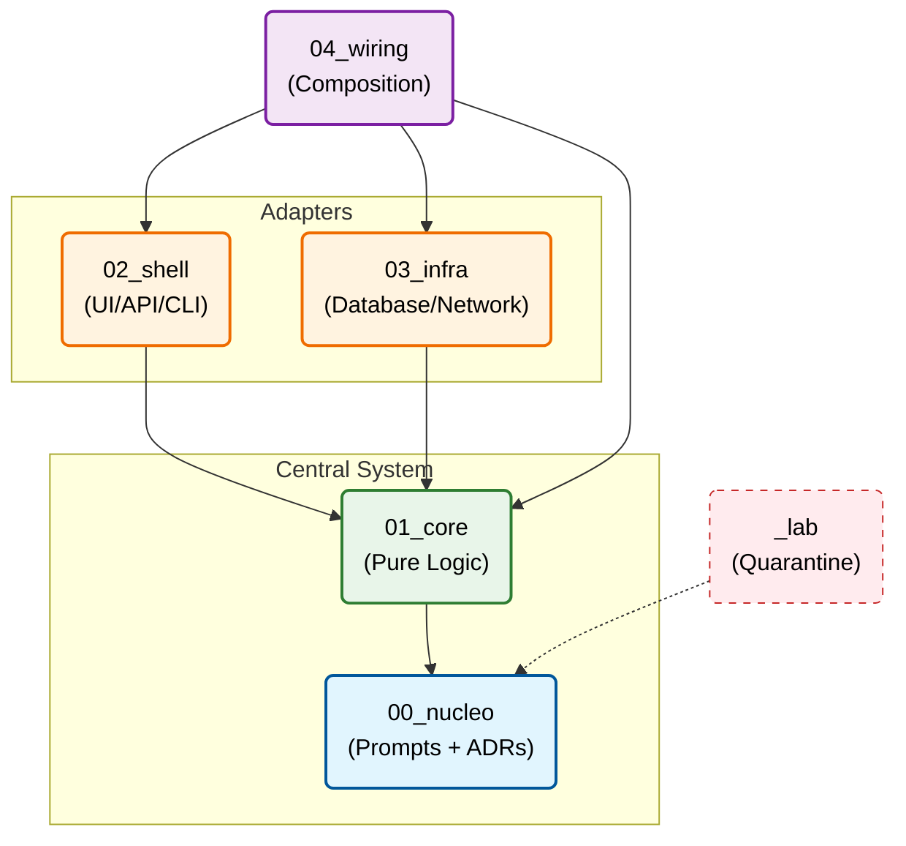

# Crystalline Architecture

<div align="center">

**A structural framework for sustainable AI-assisted development**

[](./MANIFESTO.md)
[](./LICENSE)

[**Manifesto**](./MANIFESTO.md) • [**Quick Start**](#quick-start) • [**Documentation**](#documentation)

</div>

---

## The Core Idea

AI agents generate code from context. Context discarded after each session produces growth without traceability — every modification starts from scratch, with no memory of the original intention.

Crystalline Architecture keeps the **prompts** that generated each component inside the project itself, versioned and structurally linked to the code derived from them. The developer works in `00_nucleo` — the strata below are output, not workspace.

The agent generates **code and tests simultaneously** from the same prompt. It's not TDD, it's not code-first — it's a paradigm where specification, implementation, and verification derive from the same origin.

---

## The Structure

```
your-project/
├── 00_nucleo/     # Prompts and ADRs (The Seed)
├── 01_core/       # Pure logic, zero I/O (The Crystal)
├── 02_shell/      # UI, API, CLI (Primary Adapters)
├── 03_infra/      # Database, network, files (Secondary Adapters)
├── 04_wiring/     # Dependency injection, main() (The Composition)
└── _lab/          # Isolated experiments (Quarantine)
```

---

## Dependency Rules



`L₂` and `L₃` are independent branches — they never see each other directly.

---

## Principles

| Principle | Description |
|-----------|-----------|
| **Nucleation** | Prompt before code. No prompt in `00_nucleo` → no generation. |
| **Containment** | Directory structure as a physical boundary, not decoration. |
| **Gravity** | Dependencies flow only towards lower strata. Cycles are forbidden. |
| **Phase Isolation** | Experimental code stays in the Arena. Migration requires rewriting with a new prompt. |
| **Primacy of Invariants** | Structural violation is regression, even if the code works. |

---

## Quick Start

### 1. Create project

```bash
git clone https://github.com/Dikluwe/crystalline-architecture-standard.git my-project
cd my-project
```

### 2. Write the prompt (Nucleation)

```markdown
<!-- 00_nucleo/prompts/user-authentication.md -->
# Prompt: User Authentication

**Layer**: L1 — Core
**Created at**: 2025-01-15
**Generated files**: 01_core/domain/auth.ts, 01_core/domain/auth.test.ts

## Context
E-commerce system. No authentication logic exists yet.
This component validates credentials before issuing JWT tokens.

## Structural Constraints
- L₁: zero I/O, zero external dependencies
- Should not know how passwords are stored (that's L₃)
- Must expose interface that L₃ will implement

## Instruction
Create a pure function that validates email and compares password with bcrypt hash.
Create IUserRepository interface that abstracts fetching by email.
Generate tests alongside the code.

## Verification Criteria
Given a valid email and correct password
When validateCredentials is called
Then returns true

Given an invalid email
When validateCredentials is called
Then returns false without throwing exception

Given an incorrect password
When validateCredentials is called
Then returns false

## Expected Result
- `01_core/domain/auth.ts`: validateCredentials function + IUserRepository interface
- `01_core/domain/auth.test.ts`: tests covering the above criteria

## Revision History
| Date | Reason | Affected files |
|------|--------|----------------|
| 2025-01-15 | Initial creation | auth.ts, auth.test.ts |
```

### 3. The agent generates code and tests

```typescript
// 01_core/domain/auth.ts
/**
 * Crystalline Lineage
 * @prompt 00_nucleo/prompts/user-authentication.md
 * @layer L1
 */
export interface IUserRepository {
  findByEmail(email: string): Promise<User | null>;
}

export function validateCredentials(
  email: string,
  password: string,
  passwordHash: string
): boolean {
  const emailRegex = /^[^\s@]+@[^\s@]+\.[^\s@]+$/;
  if (!emailRegex.test(email)) return false;
  return bcrypt.compareSync(password, passwordHash);
}
```

```typescript
// 01_core/domain/auth.test.ts
/**
 * Crystalline Lineage
 * @prompt 00_nucleo/prompts/user-authentication.md
 * @layer L1
 */
describe('validateCredentials', () => {
  it('returns true for valid credentials', () => {
    const hash = bcrypt.hashSync('password123', 12);
    expect(validateCredentials('user@example.com', 'password123', hash)).toBe(true);
  });

  it('returns false for invalid email', () => {
    expect(validateCredentials('invalid-email', 'password123', 'hash')).toBe(false);
  });

  it('returns false for incorrect password', () => {
    const hash = bcrypt.hashSync('correct-password', 12);
    expect(validateCredentials('user@example.com', 'wrong-password', hash)).toBe(false);
  });
});
```

### 4. Implement infrastructure

```typescript
// 03_infra/database/user-repository.ts
/**
 * Crystalline Lineage
 * @prompt 00_nucleo/prompts/user-authentication.md
 * @layer L3
 */
import { IUserRepository } from '../../01_core/domain/auth';

export class SqlUserRepository implements IUserRepository {
  async findByEmail(email: string): Promise<User | null> {
    return await db.users.findUnique({ where: { email } });
  }
}
```

### 5. Compose

```typescript
// 04_wiring/main.ts
/**
 * Crystalline Lineage
 * @prompt 00_nucleo/prompts/user-authentication.md
 * @layer L4
 */
const repository = new SqlUserRepository(prisma);
const service = new AuthService(repository);
const controller = new AuthController(service);
```

### 6. Validate

```bash
npm run crystalline:lint
# ✅ Nucleation: OK (all files have @prompt)
# ✅ Tests: OK (test file present for each component)
# ✅ Gravity: OK (no reverse dependencies)
# ✅ Purity: OK (no I/O in 01_core)
```

---

## AI Agents Protocol

```
Task received

1. Inspect 00_nucleo/prompts/
2. Check if prompt exists for the component
   ├─ YES → Read full prompt (context, constraints, criteria, history)
   └─ NO → STOP. Ask developer to create the prompt
3. Generate code AND tests simultaneously
4. Log revision in the prompt's history
```

### Mandatory Lineage Header

```typescript
/**
 * Crystalline Lineage
 * @prompt 00_nucleo/prompts/<name>.md
 * @layer L[n]
 * @updated YYYY-MM-DD
 */
```

### Rules per layer

| Layer | Can import from | Cannot import from | Constraints |
|--------|-----------------|--------------------|------------|
| L₀ (Seed) | — | — | Prompts and ADRs only, no code |
| L₁ (Core) | L₀ | L₂, L₃, L₄, Lab | Pure functions, zero I/O |
| L₂ (Shell) | L₀, L₁ | L₃, L₄, Lab | Input/output translation |
| L₃ (Infra) | L₀, L₁ | L₂, L₄, Lab | I/O operations, persistence |
| L₄ (Wiring) | All except Lab| — | Composition only, zero logic |
| Lab | L₀ (prompts only)| All | Volatile experiments |

### Checklist before finishing

- [ ] `@prompt` present and points to existing file in `00_nucleo/`
- [ ] Test file generated alongside the code
- [ ] No prohibited imports for the layer
- [ ] If in `01_core/`: zero I/O operations
- [ ] Revision logged in the prompt's history

---

## Documentation

| Document | Description |
|-----------|-----------|
| [MANIFESTO.md](./MANIFESTO.md) | The proposition and the principles |
| [00_nucleo/README.md](./00_nucleo/README.md) | Prompts and ADRs |
| [01_core/README.md](./01_core/README.md) | Pure logic |
| [02_shell/README.md](./02_shell/README.md) | Primary adapters |
| [03_infra/README.md](./03_infra/README.md) | Infrastructure |
| [04_wiring/README.md](./04_wiring/README.md) | Composition |
| [_lab/README.md](./_lab/README.md) | Experiments |

---

## Tools

### Crystalline Linter

```bash
npm run crystalline:lint
# Checks: nucleation, tests present, gravity, L₁ purity
```

### CI/CD Integration

```yaml
name: Crystalline Integrity
on: [push, pull_request]
jobs:
  validate:
    runs-on: ubuntu-latest
    steps:
      - uses: actions/checkout@v3
      - name: Validate structure
        run: npm run crystalline:lint
```

---

## Industry Patterns Mapping

| Crystalline | Clean Architecture | Hexagonal | DDD |
|------------|-------------------|-----------|-----|
| `00_nucleo` | — | — | Ubiquitous Language |
| `01_core` | Entities | Application Core | Domain Layer |
| `02_shell` | Interface Adapters | Primary Adapters | Application Layer |
| `03_infra` | Frameworks & Drivers | Secondary Adapters | Infrastructure |
| `04_wiring` | Main | — | Composition Root |
| `_lab` | — | — | Spikes / POCs |

---

## License

MIT — Use freely in any project.

---

## Citation

```bibtex
@misc{crystalline2025,
  title={Crystalline Architecture: A Structural Framework for Sustainable AI-Assisted Development},
  author={Diego Kluwe de Souza},
  year={2025},
  howpublished={\url{https://github.com/Dikluwe/crystalline-architecture-standard}}
}
```
