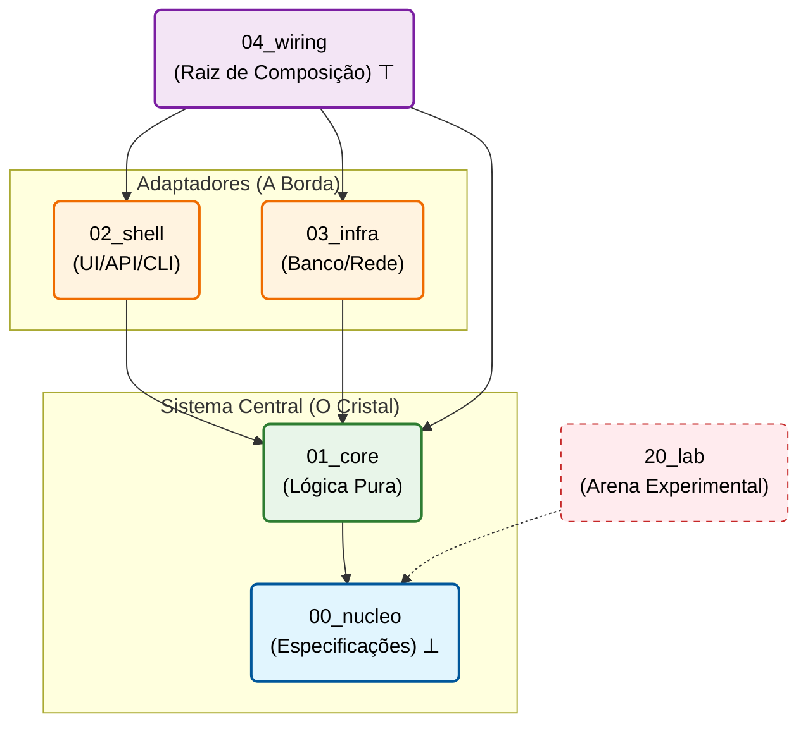

# Padrão de Arquitetura Cristalina

<div align="center">

**Um framework de topologia reforçada para desenvolvimento resistente a IA**

[](./MANIFESTO.pt.md)
[](./LICENSE)

[**Manifesto**](./MANIFESTO.pt.md) • [**Início Rápido**](#início-rápido) • [**Documentação**](#documentação) • [**Exemplos**](#exemplos)

</div>

---

## 💎 Fundamentação Matemática

O Padrão Cristalino trata a arquitetura de software como um **Espaço Topológico** regido por leis matemáticas estritas para minimizar a entropia estrutural $H$.

### Estrutura Central

* **Topologia do Sistema** ($\mathcal{T}$): Um Grafo Acíclico Direcionado (DAG) onde nós são camadas $L_n$ e arestas são morfismos de dependência
* **Poset de Dependência**: Conjunto parcialmente ordenado $(L, \preceq)$ seguindo:
  $$L_0 \preceq L_1 \preceq \{L_2, L_3\} \preceq L_4$$
  onde $L_0$ (Núcleo) é o **elemento inferior** ($\bot$)
* **Controle de Entropia**: A **Invariante de Nucleação** impõe:
  $$\text{Código} \neq \emptyset \iff \text{Espec} \neq \emptyset$$

---

## Início Rápido (Scaffolding Tekt)

A Arquitetura Cristalina foi feita para ser construída **em parceria rigorosa com o seu Agente de IA** (Cursor, Copilot, Cline, Aider). Para iniciar um projeto novo, siga os três passos essenciais da Nucleação.

### 1. Preparar a Física do Projeto
Inicie o Lattice (as camadas) na sua pasta vazia executando o script de scaffolding ou clonando este repositório base.

```bash
git clone https://github.com/your-org/crystalline-architecture-standard.git meu-projeto
cd meu-projeto
rm -rf .git
```

### 2. Diga à sua IA como se comportar
Este repositório acompanha dois arquivos preciosos: o `.cursorrules` e o `.agentrules`.
Estes arquivos contêm comandos **absolutos e imperativos** que proíbem o seu LLM de quebrar a arquitetura (ex: ele será proibido de escrever regras de negócio sem antes criar a especificação em Texto).

*   **Se você usa Cursor IDE:** O arquivo `.cursorrules` já será lido automaticamente.
*   **Se você usa Aider/Cline/Outros:** Copie o conteúdo de `.agentrules` e alimente como *System Prompt* ou *Custom Instructions*.

### 3. Escreva sua primeira Feature (O jeito Tekt)
Nós preparamos um tutorial mecânico prático de como a IA (e você) navegam desde a especificação até a inicialização.
👉 **[Leia o guia prático: COMO IMPLEMENTAR (HOW_TO_IMPLEMENT.md)](./HOW_TO_IMPLEMENT.md)**


---

## A Estrutura do Retículo

A estrutura física de pastas atua como uma "restrição de hardware" para geração de lógica pela IA. O seu LLM será impedido (pelas regras de sistema descritas acima) de violar essa hierarquia.

```
seu-projeto/
├── 00_nucleo/     # 📋 Especificações, ADRs, Contratos (Obrigatório antes do código)
├── 01_core/       # 💎 Lógica Matemática Pura, Zero I/O, Zero Dependências Externas
├── 02_shell/      # 🖥️  Superfície: UI, APIs HTTP, CLI (Controle burro de borda)
├── 03_infra/      # 🔌 O Mundo Real: Banco de Dados, Libs pesadas, Drivers
├── 04_wiring/     # ⚡ O Deus Ex Machina: main.ts, Injeção de Dependências
├── 10_bedrock/    # 🏗️  Infra de Projeto (Docker, CI/CD)
├── 11_tools/      # 🛠️  Ferramentas de Análise (Scripts)
└── 20_lab/        # 🧪 Arena Experimental (Código de Quarentena gerado por LLM)
```

---

## Princípios Fundamentais

| # | Princípio | Propriedade Formal | Descrição |
|---|-----------|-------------------|-----------|
| 1 | **Nucleação** | Axiomatização | Especificações antes do código. Sem spec → Sem código. |
| 2 | **Contenção** | Fronteira Topológica | Estrutura de pastas como barreira física. |
| 3 | **Gravidade** | Aciclicidade Direcionada | Dependências apontam apenas para camadas inferiores. |
| 4 | **Darwinismo** | Isolamento | Código do Lab deve ser normalizado antes da produção. |

---

## Regras de Dependência



### Lendo o Diagrama

- **Setas sólidas** (→): Dependências diretas (permitidas)
- **Setas tracejadas** (⋯): Referência indireta (apenas specs)
- **Símbolos**: 
  - $\bot$ (inferior): Núcleo é a fundação
  - $\top$ (superior): Wiring vê tudo
- **Código de cores**:
  - 🔵 Azul: Especificações (fonte da verdade)
  - 🟢 Verde: Lógica pura (determinística)
  - 🟠 Laranja: Fronteiras de I/O
  - 🟣 Roxo: Camada de composição
  - 🌑 Cinza: Camadas orbitais (Suporte)
  - 🔴 Vermelho: Zona de quarentena


**Regra de Dependência**: Setas apontam **para** dependências. Setas reversas violam a gravidade.

---

## Protocolo de IA

### Para Assistentes de IA (Cursor, Copilot, Claude)

#### 1. Carregamento de Contexto (Ordem de Prioridade)

```
Tarefa: "Implementar processamento de pagamento"

Passo 1: Ler estrutura de diretórios (Topografia Intrínseca)
         ↓
Passo 2: Navegar para 00_nucleo/specs/

         ↓
Passo 3: Verificar se 00_nucleo/specs/payment-processing.md existe
         ├─ SIM → Ler spec, prosseguir com implementação
         └─ NÃO → PARAR. Criar spec primeiro (Trava de Nucleação)
         
Passo 4: Ler contratos relevantes em 00_nucleo/contracts/
Passo 5: Implementar na camada apropriada (01_core, 02_shell, 03_infra)
Passo 6: Conectar em 04_wiring/
```

#### 2. Cabeçalho de Linhagem Obrigatório

Todo arquivo DEVE incluir:

```typescript
/**
 * Crystalline Lineage
 * @spec 00_nucleo/specs/<nome-feature>.md
 * @contract 00_nucleo/contracts/<interface>.md (se aplicável)
 * @topology L[n]
 * @updated YYYY-MM-DD
 */
```

#### 3. Regras Específicas por Camada

| Camada | Pode Importar De | Não Pode Importar De | Operações Permitidas |
|--------|------------------|----------------------|----------------------|
| L₀ (Nucleus) | — | — | Apenas especificações (sem código) |
| L₁ (Core) | L₀ | L₂, L₃, L₄, Lab | Funções puras, sem I/O |
| L₂ (Shell) | L₀, L₁ | L₃, L₄, Lab | Lógica UI/API, tradução |
| L₃ (Infra) | L₀, L₁ | L₂, L₄, Lab | Operações I/O, persistência |
| L₄ (Wiring) | Todas exceto Lab | — | Apenas configuração DI |
| Lab | L₀ (apenas specs) | Todas | Experimentos (volátil) |

#### 4. Checklist Pré-Salvamento

Antes de salvar qualquer arquivo, verificar:
- [ ] Tag `@spec` presente e aponta para arquivo existente
- [ ] Sem imports proibidos (verificar tabela acima)
- [ ] Se em `01_core/`: absolutamente zero operações I/O
- [ ] Implementação está conforme requisitos da spec
- [ ] Sem dependências circulares

---

## Documentação

### Documentos Centrais

| Documento | Descrição |
|-----------|-----------|
| [**MANIFESTO.pt.md**](./MANIFESTO.pt.md) | Documento constitucional com fundamentos matemáticos |
| [**MANIFESTO.md**](./MANIFESTO.md) | English version |


### Guias por Camada

| Camada | Guia | Propósito |
|--------|------|-----------|
| L₀ | [00_nucleo/README.md](./00_nucleo/README.md) | Escrita de especificações |
| L₁ | [01_core/README.md](./01_core/README.md) | Diretrizes de lógica pura |
| L₂ | [02_shell/README.md](./02_shell/README.md) | Padrões de adaptador |
| L₃ | [03_infra/README.md](./03_infra/README.md) | Configuração de infraestrutura |
| L₄ | [04_wiring/README.md](./04_wiring/README.md) | Configuração DI |
| L₂₀ | [20_lab/README.md](./20_lab/README.md) | Protocolos de experimento |


### Configuração para IA

| Arquivo | Propósito | Alvo |
|---------|-----------|------|
| [.cursorrules](./.cursorrules) | Regras do Cursor IDE | Cursor |
| [.agentrules](./.agentrules) | Regras gerais para LLM | Claude, GPT-4, Gemini |

---

## Mapeamento para Padrões da Indústria

| Cristalina | Clean Architecture | Hexagonal | DDD |
|------------|-------------------|-----------|-----|
| `00_nucleo` | — | — | Linguagem Ubíqua |
| `01_core` | Entidades | Núcleo da Aplicação | Camada de Domínio |
| `02_shell` | Adaptadores de Interface | Adaptadores Primários | Camada de Aplicação |
| `03_infra` | Frameworks & Drivers | Adaptadores Secundários | Infraestrutura |
| `04_wiring` | Main | — | Raiz de Composição |

---

## Exemplos

| Domínio | Repositório | Status |
|---------|-------------|--------|
| Compilador (Typst) | [typst-crystalline](https://github.com/Dikluwe/typst-crystalline) | 🚧 Em Progresso |
| Web API (E-commerce) | [examples/shop/](./examples/shop/) | 📝 Planejado |
| Embarcado (IoT) | [examples/iot/](./examples/iot/) | 📝 Planejado |

---

### Ferramentas de Verificação

*Em desenvolvimento: Adaptação do `ai-coders-context` para validação de Transparência Sintática.*


---

## Contribuindo

Veja [CONTRIBUTING.md](./CONTRIBUTING.md) para diretrizes.

**Regra Principal**: Todas as contribuições devem seguir o Protocolo de Nucleação (spec antes do código).

---

## Licença

Licença MIT — Use livremente em qualquer projeto.

---

## Citação

Se você usar a Arquitetura Cristalina em pesquisa, por favor cite:

```bibtex
  @misc{crystalline2025,
  title={Crystalline Architecture: A Topology-Enforced Framework for AI-Resistant Software Development},
  author={Diego Kluwe de Souza},
  year={2025},
  howpublished={\url{https://github.com/Dikluwe/crystalline-architecture-standard}}
}
```
