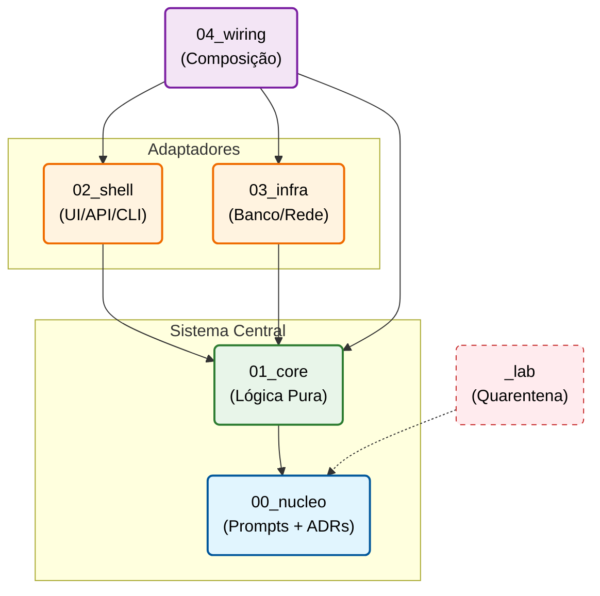

# Arquitetura Cristalina

<div align="center">

**Um framework estrutural para desenvolvimento sustentável com agentes de IA**

[](./MANIFESTO.pt.md)
[](./LICENSE)

[**Manifesto**](./MANIFESTO.pt.md) • [**Início Rápido**](#início-rápido) • [**Documentação**](#documentação)

</div>

---

## A Ideia Central

Agentes de IA geram código a partir de contexto. Contexto descartado após cada sessão produz crescimento sem rastreabilidade — cada modificação parte do zero, sem memória da intenção original.

A Arquitetura Cristalina mantém os **prompts** que geraram cada componente dentro do próprio projeto, versionados e estruturalmente ligados ao código que deles deriva. O desenvolvedor trabalha em `00_nucleo` — os estratos abaixo são output, não workspace.

O agente gera **código e testes simultaneamente** a partir do mesmo prompt. Não é TDD, não é code-first — é um paradigma onde especificação, implementação e verificação derivam da mesma origem.

---

## A Estrutura

```
seu-projeto/
├── 00_nucleo/     # Prompts e ADRs (A Semente)
├── 01_core/       # Lógica pura, zero I/O (O Cristal)
├── 02_shell/      # UI, API, CLI (Adaptadores Primários)
├── 03_infra/      # Banco de dados, rede, arquivos (Adaptadores Secundários)
├── 04_wiring/     # Injeção de dependência, main() (A Composição)
└── _lab/          # Experimentos isolados (Quarentena)
```

---

## Regras de Dependência



`L₂` e `L₃` são ramos independentes — nunca se enxergam diretamente.

---

## Princípios

| Princípio | Descrição |
|-----------|-----------|
| **Nucleação** | Prompt antes de código. Sem prompt em `00_nucleo` → sem geração. |
| **Contenção** | Estrutura de pastas como fronteira física, não decoração. |
| **Gravidade** | Dependências fluem apenas para estratos inferiores. Ciclos são proibidos. |
| **Isolamento de Fases** | Código experimental fica na Arena. Migração exige reescrita com novo prompt. |
| **Primazia dos Invariantes** | Violação estrutural é regressão, mesmo que o código funcione. |

---

## Início Rápido

### 1. Criar projeto

```bash
git clone https://github.com/Dikluwe/crystalline-architecture-standard.git meu-projeto
cd meu-projeto
```

### 2. Escrever o prompt (Nucleação)

```markdown
<!-- 00_nucleo/prompts/autenticacao-usuario.md -->
# Prompt: Autenticação de Usuário

**Camada**: L1 — Núcleo
**Criado em**: 2025-01-15
**Arquivos gerados**: 01_core/domain/auth.ts, 01_core/domain/auth.test.ts

## Contexto
Sistema de e-commerce. Nenhuma lógica de autenticação existe ainda.
Este componente valida credenciais antes de emitir tokens JWT.

## Restrições Estruturais
- L₁: zero I/O, zero dependências externas
- Não deve conhecer como senhas são armazenadas (isso é L₃)
- Deve expor interface que L₃ implementará

## Instrução
Criar função pura que valida email e compara senha com hash bcrypt.
Criar interface IRepositorioUsuario que abstrai a busca por email.
Gerar testes junto com o código.

## Critérios de Verificação
Dado email válido e senha correta
Quando validarCredenciais for chamada
Então retorna true

Dado email inválido
Quando validarCredenciais for chamada
Então retorna false sem lançar exceção

Dado senha incorreta
Quando validarCredenciais for chamada
Então retorna false

## Resultado Esperado
- `01_core/domain/auth.ts`: função validarCredenciais + interface IRepositorioUsuario
- `01_core/domain/auth.test.ts`: testes cobrindo os critérios acima

## Histórico de Revisões
| Data | Motivo | Arquivos afetados |
|------|--------|-------------------|
| 2025-01-15 | Criação inicial | auth.ts, auth.test.ts |
```

### 3. O agente gera código e testes

```typescript
// 01_core/domain/auth.ts
/**
 * Crystalline Lineage
 * @prompt 00_nucleo/prompts/autenticacao-usuario.md
 * @layer L1
 */
export interface IRepositorioUsuario {
  buscarPorEmail(email: string): Promise<Usuario | null>;
}

export function validarCredenciais(
  email: string,
  senha: string,
  hashSenha: string
): boolean {
  const emailRegex = /^[^\s@]+@[^\s@]+\.[^\s@]+$/;
  if (!emailRegex.test(email)) return false;
  return bcrypt.compareSync(senha, hashSenha);
}
```

```typescript
// 01_core/domain/auth.test.ts
/**
 * Crystalline Lineage
 * @prompt 00_nucleo/prompts/autenticacao-usuario.md
 * @layer L1
 */
describe('validarCredenciais', () => {
  it('retorna true para credenciais válidas', () => {
    const hash = bcrypt.hashSync('senha123', 12);
    expect(validarCredenciais('user@example.com', 'senha123', hash)).toBe(true);
  });

  it('retorna false para email inválido', () => {
    expect(validarCredenciais('email-invalido', 'senha123', 'hash')).toBe(false);
  });

  it('retorna false para senha incorreta', () => {
    const hash = bcrypt.hashSync('senha-correta', 12);
    expect(validarCredenciais('user@example.com', 'senha-errada', hash)).toBe(false);
  });
});
```

### 4. Implementar infraestrutura

```typescript
// 03_infra/database/repositorio-usuario.ts
/**
 * Crystalline Lineage
 * @prompt 00_nucleo/prompts/autenticacao-usuario.md
 * @layer L3
 */
import { IRepositorioUsuario } from '../../01_core/domain/auth';

export class RepositorioUsuarioSql implements IRepositorioUsuario {
  async buscarPorEmail(email: string): Promise<Usuario | null> {
    return await db.usuarios.findUnique({ where: { email } });
  }
}
```

### 5. Compor

```typescript
// 04_wiring/main.ts
/**
 * Crystalline Lineage
 * @prompt 00_nucleo/prompts/autenticacao-usuario.md
 * @layer L4
 */
const repositorio = new RepositorioUsuarioSql(prisma);
const servico = new ServicoAuth(repositorio);
const controller = new ControllerAuth(servico);
```

### 6. Validar

```bash
npm run crystalline:lint
# ✅ Nucleação: OK (todos os arquivos têm @prompt)
# ✅ Testes: OK (arquivo de teste presente para cada componente)
# ✅ Gravidade: OK (sem dependências reversas)
# ✅ Pureza: OK (sem I/O em 01_core)
```

---

## Protocolo para Agentes de IA

```
Tarefa recebida

1. Inspecionar 00_nucleo/prompts/
2. Verificar se prompt existe para o componente
   ├─ SIM → Ler prompt completo (contexto, restrições, critérios, histórico)
   └─ NÃO → PARAR. Solicitar ao desenvolvedor que crie o prompt
3. Gerar código E testes simultaneamente
4. Registrar revisão no histórico do prompt
```

### Cabeçalho de linhagem obrigatório

```typescript
/**
 * Crystalline Lineage
 * @prompt 00_nucleo/prompts/<nome>.md
 * @layer L[n]
 * @updated YYYY-MM-DD
 */
```

### Regras por camada

| Camada | Pode importar de | Não pode importar de | Restrições |
|--------|------------------|----------------------|------------|
| L₀ (Semente) | — | — | Apenas prompts e ADRs, sem código |
| L₁ (Núcleo) | L₀ | L₂, L₃, L₄, Lab | Funções puras, zero I/O |
| L₂ (Casca) | L₀, L₁ | L₃, L₄, Lab | Tradução de entrada/saída |
| L₃ (Infra) | L₀, L₁ | L₂, L₄, Lab | Operações I/O, persistência |
| L₄ (Fiação) | Todas exceto Lab | — | Apenas composição, zero lógica |
| Lab | L₀ (prompts apenas) | Todas | Experimentos voláteis |

### Checklist antes de finalizar

- [ ] `@prompt` presente e aponta para arquivo existente em `00_nucleo/`
- [ ] Arquivo de teste gerado junto com o código
- [ ] Sem imports proibidos para a camada
- [ ] Se em `01_core/`: zero operações de I/O
- [ ] Revisão registrada no histórico do prompt

---

## Documentação

| Documento | Descrição |
|-----------|-----------|
| [MANIFESTO.pt.md](./MANIFESTO.pt.md) | A proposição e os princípios |
| [00_nucleo/README.pt.md](./00_nucleo/README.pt.md) | Prompts e ADRs |
| [01_core/README.pt.md](./01_core/README.pt.md) | Lógica pura |
| [02_shell/README.pt.md](./02_shell/README.pt.md) | Adaptadores primários |
| [03_infra/README.pt.md](./03_infra/README.pt.md) | Infraestrutura |
| [04_wiring/README.pt.md](./04_wiring/README.pt.md) | Composição |
| [_lab/README.pt.md](./_lab/README.pt.md) | Experimentos |

---

## Ferramentas

### Crystalline Linter

```bash
npm run crystalline:lint
# Verifica: nucleação, testes presentes, gravidade, pureza de L₁
```

### Integração CI/CD

```yaml
name: Integridade Cristalina
on: [push, pull_request]
jobs:
  validate:
    runs-on: ubuntu-latest
    steps:
      - uses: actions/checkout@v3
      - name: Validar estrutura
        run: npm run crystalline:lint
```

---

## Mapeamento com padrões da indústria

| Cristalina | Clean Architecture | Hexagonal | DDD |
|------------|-------------------|-----------|-----|
| `00_nucleo` | — | — | Linguagem Ubíqua |
| `01_core` | Entidades | Core da Aplicação | Camada de Domínio |
| `02_shell` | Adaptadores de Interface | Adaptadores Primários | Camada de Aplicação |
| `03_infra` | Frameworks & Drivers | Adaptadores Secundários | Infraestrutura |
| `04_wiring` | Main | — | Composition Root |
| `_lab` | — | — | Spikes / POCs |

---

## Licença

MIT — Use livremente em qualquer projeto.

---

## Citação

```bibtex
@misc{crystalline2025,
  title={Crystalline Architecture: A Structural Framework for Sustainable AI-Assisted Development},
  author={Diego Kluwe de Souza},
  year={2025},
  howpublished={\url{https://github.com/Dikluwe/crystalline-architecture-standard}}
}
```
